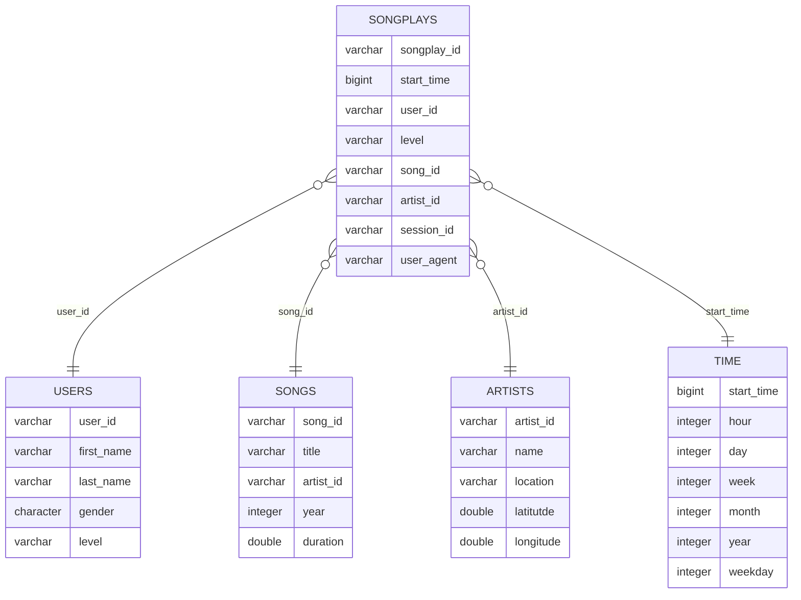

# Udacity Data Enginnering - Postgres Project

The goal of this project is to design a simple star schema database for a music streaming app. To ease development, Docker containers were used, as inspired by [this project](https://github.com/kenhanscombe/project-postgres).

## Data extraction
Raw data is stored in JSON files. These represent the starting point of our ETL pipeline.

## Database setup
We set up the database in a star schema with one fact table and four dimension tables. This is handled by the `create_tables.py` script.

The fact table is `songplays`, which contains all relevant logged data about user activity in the music streaming app.

As for the dimensions, we split them as follows:
- `users`
- `songs`
- `artists`
- `time`

The link between tables can be observed in the below Entity Relationship Diagram (ERD) - generated with [mermaid.js](https://mermaid.live).

Table creation and deletion queries, as well as value insertion ones and stored in the `sql_queries.py` module. To aid in building the queries, the `schemas.py` and `helpers.py` modules provide convenient functionalities to create the queries needed by the ETL pipeline.

## Running the ETL pipeline
Once the tables are constructed, the ETL pipeline can be executed by running the `etl.py` script. This will read in the song and log data from their respective sub-directories of the `data/` directory.

## Possible analytics
The currently set up relational database allows dashboards and analytics tooling to be set up such that business users can derive a variety of insights, such as:
- the most popular times for music playback by day of week
- the average length of a user playback session
- most played artists or songs over time

## Future work
Here is a list of topics that can be addressed to further improve ETL performance:
- Perform BULK insertions from raw JSON files
- Add foreign key constraints to fact table based on dimensions
- Add index(es) to improve query read performance at the expense of writes and storage usage. This would only work if we knew the most common queries that would be executed against this data and if performance was indeed a problem
- Build simple health monitoring dashboard that keeps track of database statistics (e.g., record counts, unique songs / artists)