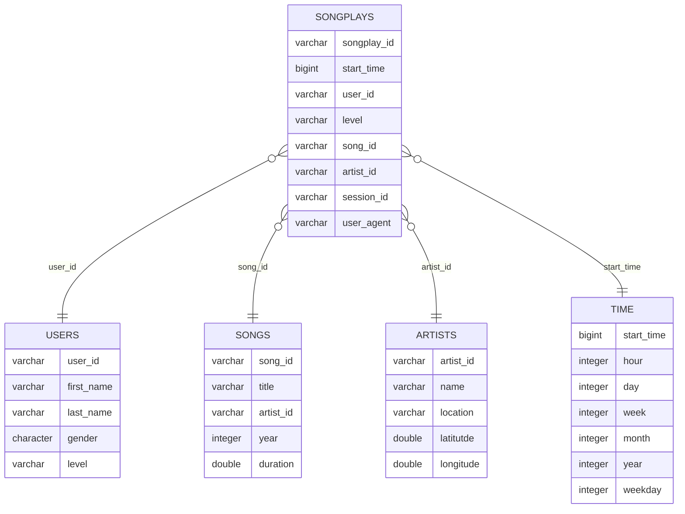

# Entity Relationship Diagram (ERD)

Generated with [mermaid.js](https://mermaid.live)

```mermaid
erDiagram
    SONGPLAYS }o--|| USERS : user_id
    SONGPLAYS }o--|| SONGS : song_id
    SONGPLAYS }o--|| ARTISTS : artist_id
    SONGPLAYS }o--|| TIME : start_time

    SONGPLAYS {
        varchar songplay_id
        bigint start_time
        varchar user_id
        varchar level
        varchar song_id
        varchar artist_id
        varchar session_id
        varchar user_agent
    }
    USERS {
        varchar user_id
        varchar first_name
        varchar last_name
        character gender
        varchar level
    }
    SONGS {
        varchar song_id
        varchar title
        varchar artist_id
        integer year
        double duration
    }
    ARTISTS {
        varchar artist_id
        varchar name
        varchar location
        double latitutde
        double longitude
    }
    TIME {
        bigint start_time
        integer hour
        integer day
        integer week
        integer month
        integer year
        integer weekday
    }
```